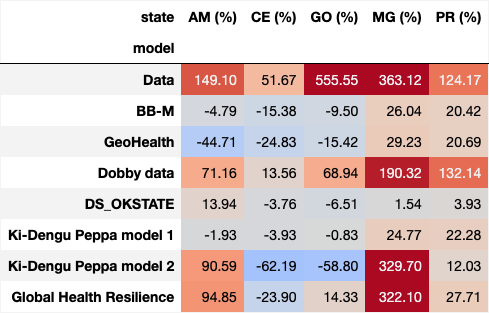
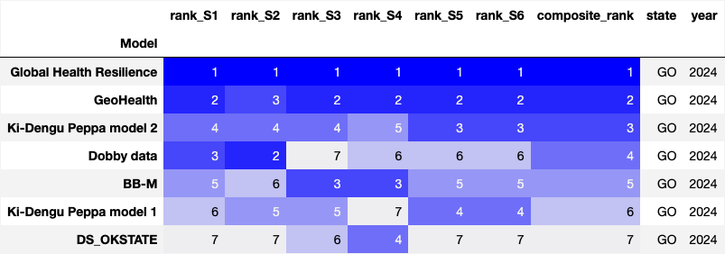
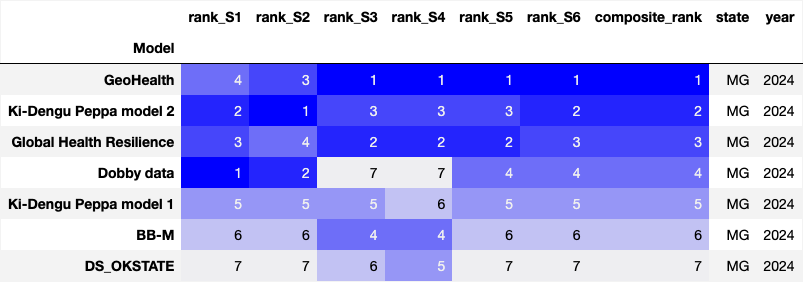
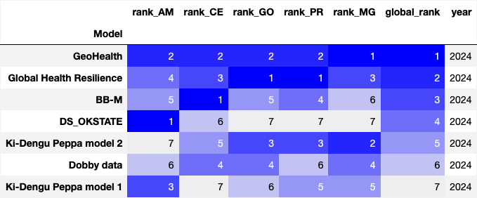
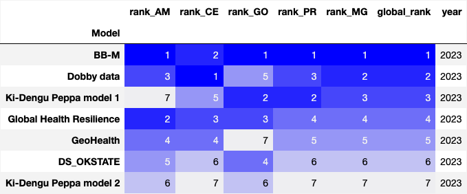
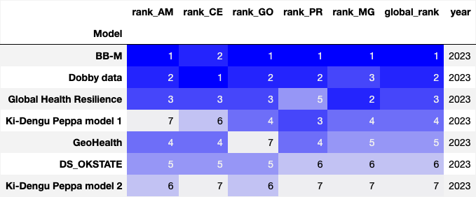
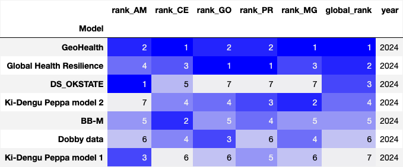
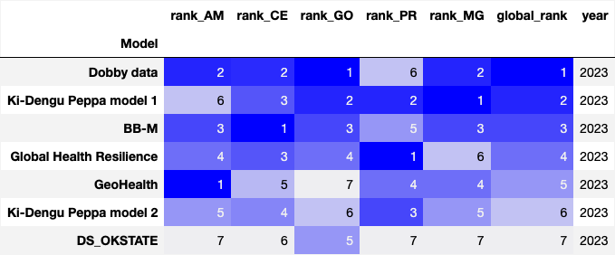

 ## Teams and models 
The Mosqlimate group assessed the performance of each model using a set of scores. The logarithmic score, CRPS and the interval score were computed using the 'ScoringRules Python package'. Other metrics were also  calculated as additional feedback for the teams. These additional metrics include (i) average scores in the epidemic peak (3-week window centered on the peak) and (ii) the percent increase of epidemic peak size when comparing 2024 and 2023.

Seven teams participated in the Dengue 2024 Sprint. They submited dengue predictions using a variety of modeling approaches:

1. [Dobby Data](https://github.com/eduardocorrearaujo/lstm_transf_to_state) (DD)- LTSM model
3. [GeoHealth](https://github.com/ChenXiang1998/Infodengue-Sprint/tree/main/model) (GH) - Prophet model with PCA and variance threshold and LSTM model with PCA and variance threshold Models
4. [Global Health Resilience](https://github.com/giovemoiran/infodengue-sprint-lsl) (GHR) - Temp-SPI Interaction Model
5. [BB-M](https://github.com/lsbastos/bb-m) (BBM) - Bayesian baseline random effects model
6. [Ki-Dengu Peppa](https://github.com/Mosqlimate-project/kidenguPeppa) (KDP)- Weekly and yearly (iid) components and Weekly and yearly (rw1) components Models
7. [DS_OKSTATE](https://github.com/haridas-das/DS_OKSTATE) (OK) - Info dengue CNN LSTM Ensemble Model

All team's forecasts were visualized and compared in the Mosqlimate platform, which is designed for comparing arbovirus forecasting experiments using the following tools:

• climatic, demographic and case open datasets: https://api.mosqlimate.org/datastore/

• Model Registry: https://api.mosqlimate.org/models/

• Visualization tools: https://api.mosqlimate.org/vis/dashboard

All teams successfully submitted to the platform their forecasts for the 2022-2023 and 2023-2024 seasons for the states of Amazonas (AM), Ceará (CE), Goiás (GO), Minas Gerais (MG), and Paraná (PR).

# Scoring and Ranking

## Scores
The logarithmic score, CRPS and interval score were calculated using the Python package [mosqlient](https://github.com/Mosqlimate-project/mosqlimate-client/tree/main) which captures the predictions from the API and compares them using some scores implemented in the Python package `scoringrules`. 

The *CRPS* was computed using the equation below:

$$
CRPS(\mathcal{N}(\mu_i, \sigma^2_i), y_i) = \sigma_i \{ \omega_i[\Phi(\omega_i) - 1] + 2\phi(\omega_i) - \frac{1}{\sqrt{\pi}}\},
$$

where $\Phi(\omega_i)$ and $\phi(\omega_i)$ is the cumulative distribution function (CDF) and the probability density function (PDF) of the standard normal distribution, respectively, evaluated at the normalized prediction error $\omega_i = \cfrac{y_i - \mu_i}{\sigma_i}$. Additionally, $y_i$ represents the cases observed in week $i$, $i$ is the mean forecasted value in week $i$ and $\sigma_i$ is the standard deviation of the forecast on week $i$.

The *Log score* was computed using the formula below: 

$$
LogS(\mathcal{N}(\mu_i, \sigma^2_i), y_i) = log\left( \cfrac{\phi(\omega_i)}{\sigma_i}\right)
$$

The *Interval score* was computed using the formula below: 

$$
S^{int}_\alpha(l_i, u_i; y_i) = u_i - l_i + \cfrac{2}{\alpha}(l_i - y_i)I\{y_i < l_i\} + \cfrac{2}{\alpha}(y_i - u_i)I\{y_i > u_i\}
$$

where $I$ is the indicator function, $\alpha$ the significance level of the interval, $u_i$ the upper value of the interval at week $i$ and $l_i$ the lower value. 

The scores were calculated for each state and each year, corresponding to test 1 and test 2. For each combination of state and year, we averaged the scores over the full time series and over the first half.  The twelve scores are described in the table below.

| Average Score S* | Score (S) used | Evaluated range - test1  | Evaluated range - test2  |
| -----------------| ---------------|--------------------------|--------------------------|
|𝑆1     |CRPS            |EW41 2022 - EW40 2023     |EW41 2023 - EW23 2024     |
|𝑆2     |CRPS            |EW41 2022 - EW14 2023     |EW41 2023 - EW14 2024     |
|𝑆3     |Log Score       |EW41 2022 - EW40 2023     |EW41 2023 - EW23 2024     |
|𝑆4     |Log Score       |EW41 2022 - EW14 2023     |EW41 2023 - EW14 2024     |
|S5     |Interval Score  |EW41 2022 - EW40 2023     |EW41 2023 - EW23 2024     |
|S6     |Interval Score  |EW41 2022 - EW14 2023     |EW41 2023 - EW14 2024     |

where S* is given by the follow equation:

$$
S = \frac{1}{W_f}\sum_{i}^{W_f} S_i
$$

## Ranking

The models were ranked according to each score, that is, each model received rank $R_1$, $R_2$, …, $R_6$, for each year and state. Finally, the final ranking $R_{Y,S}$ (column `composite_rank`)of the models were calculated with the following formula, for each **year** and **state**:

$$
R_{Y,S} = \sum^{6}_{i=1} = \cfrac{1}{R_i}
$$

where each $S$ value represent one of the mandatory states.

The global ranking (colum `global_rank`) were calculated for each **year**  using the equation below

 

# Results

Table below shows the teams and their corresponding model id: 

| Team                     | Model id | Approach and reference     |
| ------------------------ | -------- |--------------------------- |
| D-fense                  | ---------|--------------------------- |
| Dobby Data (DD)          | 21   |[LTSM model](https://github.com/eduardocorrearaujo/lstm_transf_to_state)|
| Global Health Resilience (GHR) | 22   |[Temp-SPI Interaction Model](https://github.com/giovemoiran/infodengue-sprint-lsl)|
| GeoHealth (GH)           | 25, 26 |[Prophet and LTSM PCA variance threshold models](https://github.com/ChenXiang1998/Infodengue-Sprint/tree/main/model)|
| Ki-Dengu Peppa (KDP)     | 27, 28 |[Weekly and yearly (iid) and Weekly and yearly (rw1) components Models](https://github.com/Mosqlimate-project/kidenguPeppa)|
| DS_OKSTATE (OK)          | 29   |[Info dengue CNN LSTM Ensemble Model](https://github.com/haridas-das/DS_OKSTATE)|
| BB-M (BBM)               | 30   |[Bayesian baseline random effects model - BB-M](https://github.com/lsbastos/bb-m)|

 
 * Since the GeoHealth team provided 8 predictions using model 25 and 2 using model 26, and each model made predictions for diferent states, to have consistency in the table legends and figures below, we refer to model 25, and 26 as GeoHealth in the tables and Figures.

## Predicted Curves

The plots below show the predicted and observed epidemic curves for the two years: 2023 and 2024. The code to generate the plot are available in the notebook `comp_the_predictions.ipynb`.

### Predicting 2024 peak increase
In order to assess the models ability to predict the increase in 2024 with respect to 2023, we compute an increase rate (IR) using the peak of cases ($P$) in each year using the equation below: 

$$IR= \cfrac{P_{2024} - P_{2023}}{P_{2023}} \times 100$$

The results are in shown table below: 

In 2024, all states presented higher dengue peaks than in 2023. In MG and GO, the peaks were three times and five times higher, respectively. In general, the performance of the models was better in PR and MG where all models predicted an increase in the epidemic peak in 2024. We highlight DD model as the only one that predicted increase in all states, and GHR & KDP as the ones that most accurately performed in MG.    

## Scoring

All figures in this section were generated in the `compare_the_scores_figures.ipynb` notebook. 

### CRPS score
The Figure below shows the weekly CRPS score of each model, by state. **Lower is better**: 

### Log score
The Figure below presents the weekly Log score by model and state. The Log score was truncated in -100. **Higher is better**: 

### Interval score
The Figure below presents the weekly interval score by model and state. **Lower is better**: 

## Ranking 

The figures in this section are generated in the `Apply_the_score_to_predictions.ipynb` notebook. 

For each state, we show the rank of the models in 2023 and 2024. 

For AM: 

| AM - 2023 | AM - 2024 |
|--------|--------|
|  |  |

For CE: 

| CE - 2023 | CE - 2024 |
|--------|--------|
|  |  |

For GO: 

| GO - 2023 | GO - 2024 |
|--------|--------|
|  |  |

For PR: 

| PR - 2023 | PR - 2024 |
|--------|--------|
|  |  |

For MG: 

| MG - 2023 | MG - 2024 |
|--------|--------|
|  |  |

### Global ranking
The global rank summarizes the performance of the models among all five states using the six scores described above. The results are presented per year.  

| Global - 2023 | Global - 2024 |
|--------|--------|
|  |  |

### Global ranking using the scores: 𝑆1 , 𝑆3 , and 𝑆5 

Here, the rank measures the performance of the models considering the full time series. 

| Global - 2023 | Global - 2024 |
|--------|--------|
|  |  |

### Global ranking using the scores: 𝑆2 , 𝑆4 , and 𝑆6 

Here, the rank measures the performance of the models considering only the first half of the time series. 

| Global - 2023 | Global - 2024 |
|--------|--------|
|  |  |

### Peak accuracy ranking

The overall rating was also calculated in a 3-week window centered on the peak. In this case, the ranking is calculated based on just 3 scores: CRPS, Record score and Interval score, but the logic used remains the same.  

| Global (peak) - 2023 | Global (peak) - 2024 |
|--------|--------|
|  |  |

The table above was created using the notebook `Apply_the_score_peaks.ipynb`

# Conclusion

In the spirit of the olympyc games we have compiled a medal table to recognize the top three models on each sub-challenge.

## Final Medal Table

