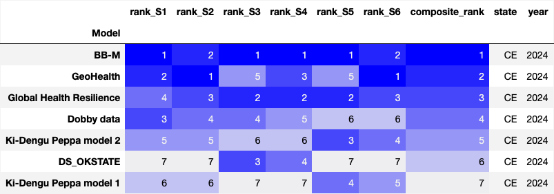

## Teams and models 
The Mosqlimate group assessed the performance of each model using a set of scores, over the entire prediction window. The logarithmic score, CRPS and the interval score were computed using the 'ScoringRules Python package'. Other metrics were also  calculated as additional feedback for the teams, but do not enter the composition of the various ranking of the models. These additional metrics include (i) average scores in specific parts of the prediction window, considering epidemic onset (weeks between growth start and the peak) and epidemic peak (3-week window centered on the peak) and (ii) the time lag which maximizes the cross-correlation between forecasts and data.

Seven teams participated in the Dengue 2024 Sprint. They submited dengue predictions using a variety of modeling approaches:

1. [Dobby Data](https://github.com/eduardocorrearaujo/lstm_transf_to_state) - LTSM model
3. [GeoHealth](https://github.com/ChenXiang1998/Infodengue-Sprint/tree/main/model) - Prophet model with PCA and variance threshold and LSTM model with PCA and variance threshold Models
4. [Global Health Resilience](https://github.com/giovemoiran/infodengue-sprint-lsl) - Temp-SPI Interaction Model
5. [BB-M](https://github.com/lsbastos/bb-m) - Bayesian baseline random effects model
6. [Ki-Dengu Peppa](https://github.com/Mosqlimate-project/kidenguPeppa) - Weekly and yearly (iid) components and Weekly and yearly (rw1) components Models
7. [DS_OKSTATE](https://github.com/haridas-das/DS_OKSTATE) - Info dengue CNN LSTM Ensemble Model

All teams' forecast can be visualized and compared in the Mosqlimate platform for comparing arbovirus forecasting experiments:
• climatic, demographic and case open datasets: https://api.mosqlimate.org/datastore/

• Model Registry: https://api.mosqlimate.org/models/

• Visualization tools: https://api.mosqlimate.org/vis/dashboard

All teams submitted forecasts for the 2022-2023 and 2023-2024 seasons for the states of Amazonas (AM), Ceará (CE), Goiás (GO), Minas Gerais (MG), and Paraná (PR).

# Scoring and Ranking

## Scores
The logarithmic score, CRPS and interval score were calculated using the Python package [mosqlient](https://github.com/Mosqlimate-project/mosqlimate-client/tree/main) which captures the predictions from the API and compares them using some scores implemented in the Python package `scoringrules`. 

The *CRPS* was computed using the equation below:

$$
CRPS(\mathcal{N}(\mu_i, \sigma^2_i), y_i) = \sigma_i \{ \omega_i[\Phi(\omega_i) - 1] + 2\phi(\omega_i) - \frac{1}{\sqrt{\pi}}\},
$$

where $\Phi(\omega_i)$ and $\phi(\omega_i)$ is the cumulative distribution function (CDF) and the probability density function (PDF) of the standard normal distribution, respectively, evaluated at the normalized prediction error $\omega_i = \cfrac{y_i - \mu_i}{\sigma_i}$. Additionally, $y_i$ represents the cases observed in week $i$, $i$ is the mean forecasted value in week $i$ and $\sigma_i$ is the standard deviation of the forecast on week $i$.

The *Log score* was computed using the formula below: 

$$
LogS(\mathcal{N}(\mu_i, \sigma^2_i), y_i) = log\left( \cfrac{\phi(\omega_i)}{\sigma_i}\right)
$$

The *Interval score* was computed using the formula below: 

$$
S^{int}_\alpha(l_i, u_i; y_i) = u_i - l_i + \cfrac{2}{\alpha}(l_i - y_i)I\{y_i < l_i\} + \cfrac{2}{\alpha}(y_i - u_i)I\{y_i > u_i\}
$$

where $I$ is the indicator function, $\alpha$ the significance level of the interval, $u_i$ the upper value of the interval at week $i$ and $l_i$ the lower value. 

## Ranking
For each year and state, the models were assessed according to the six scores listed in the table below.

| Average Score S* | Score (S) used | Length (Week)|
| -----------------| ---------------|--------------|
|𝑆1     |CRPS            | 52           |
|𝑆2     |CRPS            | 26           |
|𝑆3     |Log Score       | 52           |
|𝑆4     |Log Score       | 26           | 
|S5     |Interval Score  | 52           |
|S6     |Interval Score  | 26           | 

where S* is given by the follow equation:

The models were ranked according to each score, that is, each model received rank $R_1$, $R_2$, …, $R_6$, for each year and state. Finally, the final ranking $R_{Y,S}$ (column `composite_rank`)of the models were calculated with the following formula, for each **year** and **state**:

$$
S = \frac{1}{W_f}\sum_{i}^{W_f} S_i
$$

$$
R_{Y,S} = \sum^{6}_{i=1} = \cfrac{1}{R_i}
$$

where each $S$ value represent one of the mandatory states.

The global ranking (colum `global_rank`) were calculated for each **year**  using the equation below

 

# Results

Table below shows the teams and their corresponding model id: 
| Team                     | Model id | Approach and reference     |
| ------------------------ | -------- |--------------------------- |
| D-fense                  | ---------|--------------------------- |
| Dobby Data               | 21   |[LTSH model](https://github.com/eduardocorrearaujo/lstm_transf_to_state)|
| Global Health Resilience | 22   |[Temp-SPI Interaction Model](https://github.com/giovemoiran/infodengue-sprint-lsl)|
| GeoHealth                | 25, 26 |[Prophet and LTSM PCA variance threshold models](https://github.com/ChenXiang1998/Infodengue-Sprint/tree/main/model)|
| Ki-Dengu Peppa           | 27, 28 |[Weekly and yearly (iid) and Weekly and yearly (rw1) components Models](https://github.com/Mosqlimate-project/kidenguPeppa)|
| DS_OKSTATE               | 29   |[Info dengue CNN LSTM Ensemble Model](https://github.com/haridas-das/DS_OKSTATE)|
| PET                      | 30   |[Bayesian baseline random effects model - BB-M](https://github.com/lsbastos/bb-m)|

 
 * Since the GeoHealth team provided 8 predictions using model 25 and 2 using model 26, and each model made predictions for diferent states, to have consistency in the table legends and figures below, we refer to model 25, and 26 as GeoHealth in the tables and Figures.

## Predicted Curves

The plots below show the predicted and observed epidemic curves for the two years: 2022 and 2023.

## Scoring

The scores of each model were calculated weekly. 

### CRPS score
The Figure below represents the CRPS score by model and state. **Lower is better**: 

The figures in this section are generated in the `compare_the_scores_figures.ipynb` notebook. 

### Log score
The Figure below presents the Log score by model and state. **Lower is better**: 

### Interval score
The Figure below presents the interval score by model and state. **Lower is better**: 

## Ranking 

The figures in this section are generated in the `Apply_the_score_to_predictions.ipynb` notebook. 

For AM: 

| AM - 2023 | AM - 2024 |
|--------|--------|
|  |  |

For CE: 

| CE - 2023 | CE - 2024 |
|--------|--------|
|  |  |

For GO: 

| GO - 2023 | GO - 2024 |
|--------|--------|
|  |  |

For PR: 

| PR - 2023 | PR - 2024 |
|--------|--------|
|  |  |

For MG: 

| MG - 2023 | MG - 2024 |
|--------|--------|
|  |  |

### Global ranking
The global rank for each mandatory state and year is: 

| Global - 2023 | Global - 2024 |
|--------|--------|
|  |  |

### Peak accuracy ranking

The overall rating was also calculated in a 3-week window centered on the peak. In this case, the ranking is calculated based on just 3 scores: CRPS, Record score and Interval score, but the logic used remains the same.  

| Global (peak) - 2023 | Global (peak) - 2024 |
|--------|--------|
|  |  |

The table above was created using the notebook `Apply_the_score_peaks.ipynb`

# Conclusion

**to do**

