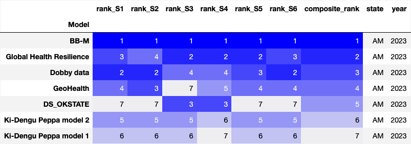
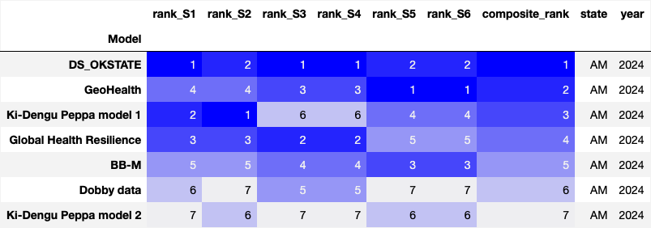
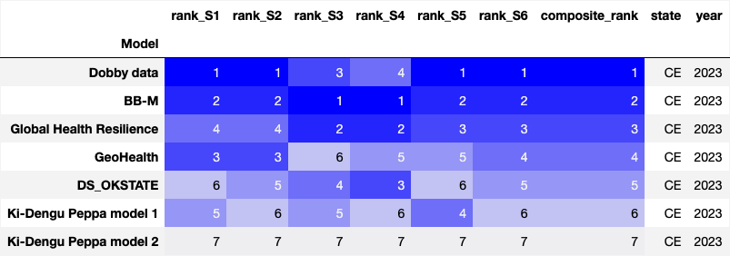
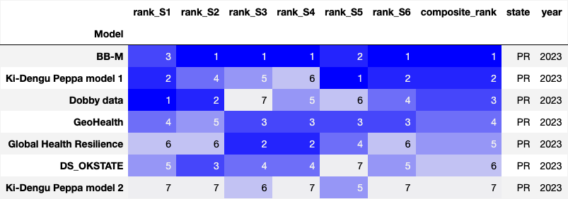

# Results of the score of the models

Teams and model_id na plataforma: 

| Team                     | Model id |
| ------------------------ | ------------- |
| D-fense                  | ------------  |
| Dobby Data               | 21            |
| GeoHealth                | 25,26*        |
| Global Health Resilience | 22            |
| bb-m                     | 30            |
| Ki-Dengu Peppa           | 27, 28        |
| DS_OKSTATE               | 29            |
 
 * Since the GeoHealth team provided 8 predictions using model 25 and 2 using model 26, and each model made predictions for diferent states, to have consistency in the table legends and figures below, we refer to model 26 as model 25 in the cases it was used.

## Scores for teams

### Ranking 

The figures in this section are generated in the `Apply_the_score_to_predictions.ipynb` notebook. 

For AM: 

| AM - 2023 | AM - 2024 |
|--------|--------|
|  |  |

For CE: 

| CE - 2023 | CE - 2024 |
|--------|--------|
|  |  |

For GO: 

| GO - 2023 | GO - 2024 |
|--------|--------|
|  |  |

For PR: 

| PR - 2023 | PR - 2024 |
|--------|--------|
|  |  |

For MG: 

| MG - 2023 | MG - 2024 |
|--------|--------|
|  |  |

Global rank based on the rank of each mandatory state: 

The Figure below represents the CRPS score by model and state: 

The figures in this section are generated in the `compare_the_scores_figures.ipynb` notebook. 

The Figure below represents the Log score by model and state: 

The Figure below represents the interval score by model and state: 

